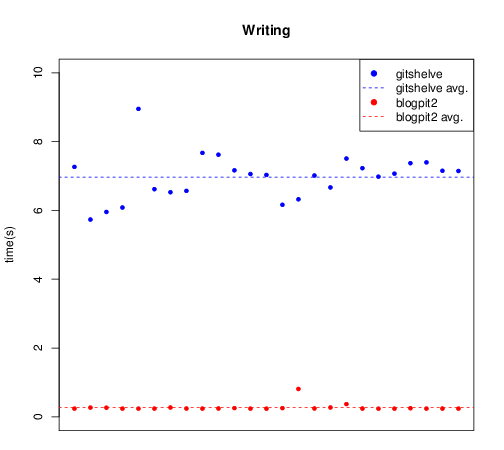
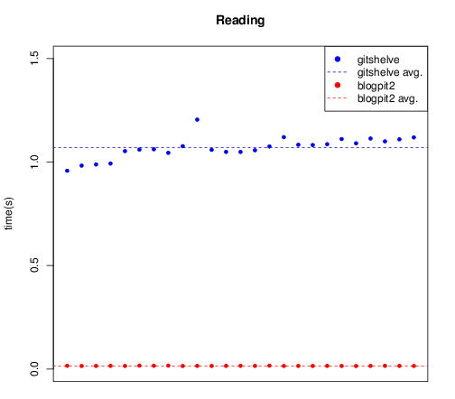

title: python-blogpit is born
tags: python, c, git
description: The new and improved version of the code that powers this web site
nocomments:
hidden:

So I had a few vacation days and decided to put some old ideas into
practice: starting with a nice upgrade for blogpit, using libgit2 instead
of gitshelve and getting a nice performance upgrade in the process.

## The battle plan

Blogpit was born as a way for me to manage my web site as a git repository,
mostly using a python library to access Git repositories - called gitshelve.
Gitshelve is a great piece of software, with a very easy API, unfortunately 
it suffered from the same problem all git libraries had at the time - access to
git was done via calls to git commands and parsing of stdout. 

But a lot has changed since then. We now have a actual library to access git
repositories (Libgit2), which is mature enough to use. This led me to the idea
of implementing a replacement for gitshelve in C as a python extension.

So my goals for this little project are:
 - Clearly separate storage logic (blogpit) from frontend (django-blogpit)
 - Turn blogpit into a C library to fetch content from a git repository
 - Create a Python module - pyblogpit - to replace gitshelve and friends

## Changes along the way

Gitshelve had something which was very well designed, its API. In gitshelve a
git repository was accessed as a python dictionary, this made it brilliantly
easy to use. I must say I miss that a lot, but it is not too late to bring that
back.

One thing we did loose was flexibility, gitshelve was a general purpose storage backend - in blogpit I took some shortcuts to accommodate my use case. 
The most relevant is that I commit whenever an article is changed, i.e. one file change one commit.
This might not be the best policy but it is the one I use for blogpit, so blogpit enforces this.

## The speed boost

So I set out to test the speed improvement of using a libgit2 based solution.
For both gitshelve and blogpit, I ran two tests (25 repetitions): 

 1. Starting from an existing repository with one commit - create
    270 commits, each one with one file in it.
 2. Read all 270 files from the repository

The 270 files are split between 26 folders, at 10 files per folder, plus 10 files in the root directory. 
The max path depth is 3, two folders and one file.
All measures are made after initializing the repository, because it would otherwise influence the measurements - blogpit initializes early, while gitshelve is lazy. 

First: content writing. The average for blogpit is ~0.27s against gitshelve's average of ~6.97s. Thats 25 times less (on average). Of course there is some very visible variation, and on the worst measured case (for blogpit) it was only 7 times faster than gitshelve. In any case a significant difference in favour of blogpit.

As for the reading cases, that is where the real pearl is hiding. blogpit is 70 times faster on average. The average time for blogpit is 0.015s vs 1.069 for gitshelve. 

## The bottom line

To sum it up:

 - On average blogpit is **25 times** faster at writing.
 - On average blogpit is **70 times** faster at reading.

Granted that this is not the most exact comparison ever made, it still shows a significant difference between blogpit and gitshelve. The results will probably fluctuate under a different CPU/IO load. There is also a lot to be said, about the missing features from GitShelve. I left them behind (for now) because for the most part I don't need them. But I will probably introduce a few of them in blogpit when I get the chance.

Now the only thing we are missing is to port this back to django-blogpit. 
The django-blogpit middleware got some changes to accommodate the new API, but
for the most part it has less lines of code than before, because I moved part of 
the Unicode handling to C. I'll be pushing those gitorious later.

## References
 - [Gitshelve](http://newartisans.com/2008/05/using-git-as-a-versioned-data-store-in-python/)
 - [Libgit2](http://libgit2.github.com/)
 - [Blogpit](https://github.com/equalsraf/blogpit)
 - [Django-blogpit](http://gitorious.org/django-blogpit)

