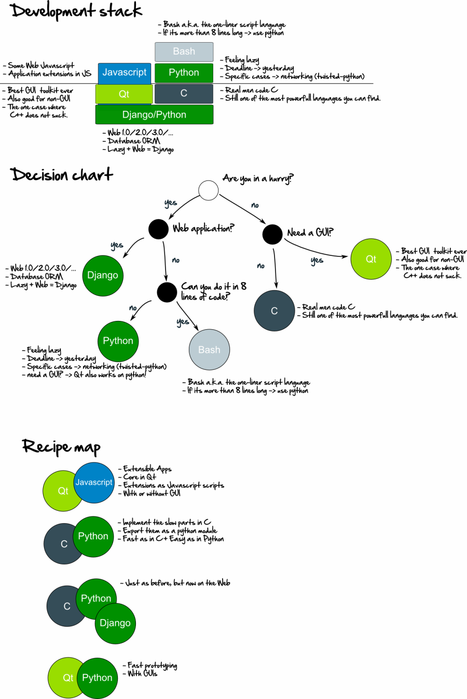

title: Development stack choices
date: 2011-11-04
description: My own development tools choice layed out in a awesome diagram

A while ago I was having a discussion with some colleagues about which development tools do you use, for each job.
The end result, three diagrams that more or less resume my usual approach to choosing development tools.

I'm mostly centered on a specific set of tools (Qt, Python, Django).
This does not mean I don't use other tools (ex: Java for mobile), but these are my choices *by default*.

What about you?
How does your development stack looks like?
What are the factors that influence you choice of programming language.

