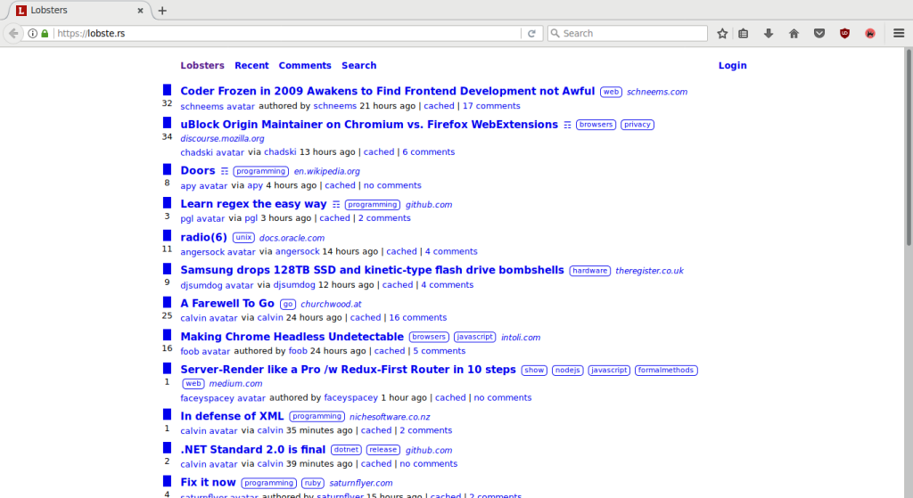

title: This is how I browse the Web
hidden:

I could go into the why, but that is a whole different discussion. In a nutshell I just want to read stuff from the Internet, your aesthetics are not something I'm interested in.

If possible, this is how I browse the web

The browser is firefox, the website is lobste.rs but there are some strange bits about it:

1. images are not visible
2. external fonts are not loaded
3. CSS colors are not loaded, but the CSS layout is in effect.

Actually this is not exactly what I was aiming for, it is still a bit short of what I wanted.
The magic settings for firefox are the following.

**permissions.default.image = 2** disables loading of all images in firefox. The value **3** is also interesting, it disables loading images from 3rd parties - but I have not tested that one.

**browser.display.use_document_fonts = 0** disables the use of external fonts. This one does exactly what I wanted, I'm not fond of loading external fonts - I like my configured fonts very much, thank you.

**browser.display.document_color_use 2** disables the use of colors from CSS rules. I was actually looking for a way to disable CSS rules entirely. Firefox has a menu for this, but not an option. The best I was able to find was this. There is at least one extension for this (Read Easily), but it is not ideal for me either.

I keep these settings in a separate profile, which I load with some shell aliases.

## Consequences disable CSS

Initially I tried to disable CSS altogether, but works really bad for some web sites

- gitter becomes useless, because frame dimensions render the website nearly invisible
- youtube/github/gitter turn into a mess, because without CSS to enforce image sizes, the icons are actually huge
- google/youtube have long preambles (navigation menus, headers) that without style are really long

## I could just use lynx :)

That would be problematic. Without javascript most sites don't work. Besides I have a bunch of firefox extensions I want to use.

Firefox has a reader mode, but it only works for some pages. And conceals information based on heuristics.

Incidentally you can grab the processed dom source from firefox via webdriver and pipe into w3m :D that helps a bit.

## References

- [http://kb.mozillazine.org/Permissions.default.image](http://kb.mozillazine.org/Permissions.default.image)
- [Read Easily](https://addons.mozilla.org/en-US/firefox/addon/read-easily/)
